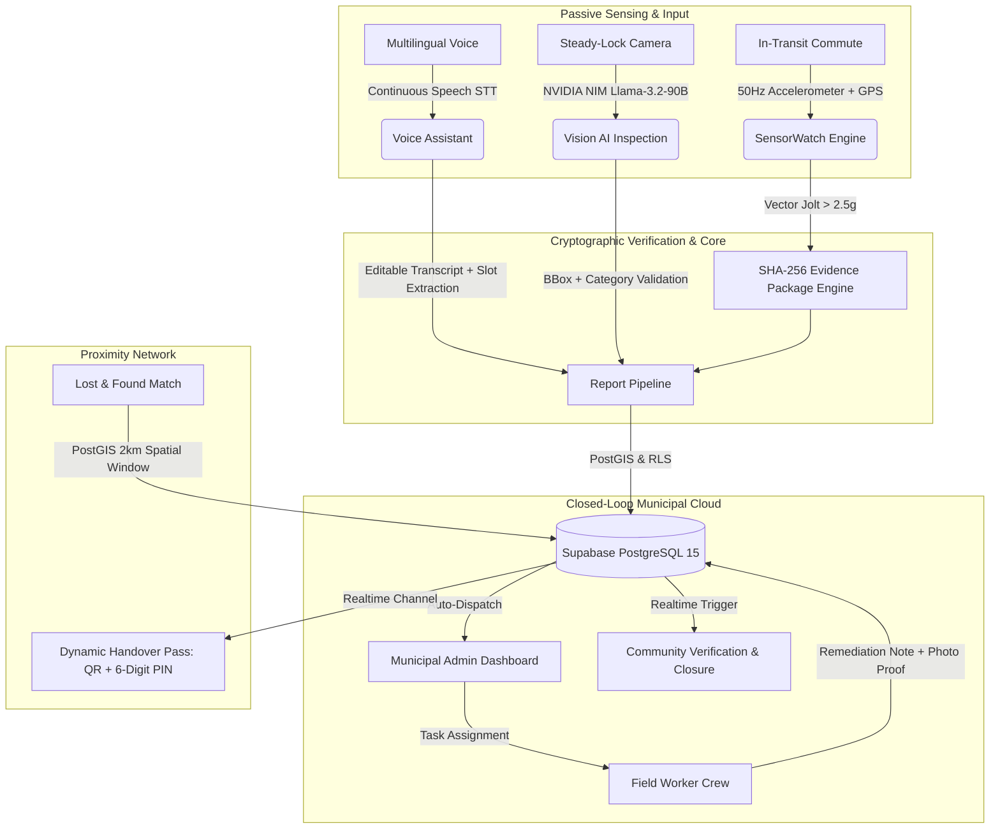

# 📱 Nivara — Your City. Your Proof. Your Voice.

<p align="center">
  
</p>

<p align="center">
  
  
  
  
  
  
  
</p>

<p align="center">
  <b>An autonomous, AI-driven civic intelligence & municipal accountability network.</b><br/>
  Passive pothole detection via cryptographic sensor telemetry, multilingual continuous voice assistance, steady-lock computer vision evidence capture, proximity lost & found handovers, and closed-loop field worker remediation.
</p>

<p align="center">
  <a href="#-apk-download"><strong>📦 Download APK</strong></a> ·
  <a href="#-bonus-point-features-added"><strong>🎁 Bonus Features</strong></a> ·
  <a href="#-key-highlights"><strong>🌟 Key Innovations</strong></a> ·
  <a href="#-solution"><strong>💡 Architecture</strong></a> ·
  <a href="#-features"><strong>✨ Feature Matrix</strong></a> ·
  <a href="#-demo-video"><strong>🎥 Demo Video</strong></a> ·
  <a href="#-installation"><strong>🚀 Quickstart</strong></a>
</p>

---

# 👥 Team Information

<p align="center">
  
</p>

## Team Name
`Team Nivara`

## Members

| Name | Role | Contact & Profiles |
|---|---|---|
| **Adithyan H** | Developer | [GitHub](https://github.com/adithyen) · [Email](mailto:adityenh@gmail.com) |

## Challenge Track

- [ ] 📚 EduTech
- [ ] 🏥 HealthTech
- [x] 🏙️ **CivicTech** *(Autonomous Urban Infrastructure Monitoring & Closed-Loop Governance)*
- [ ] 🌾 AgriTech / LocalTech
- [ ] 💡 Open Innovation

---

# 📖 Problem Statement

Urban infrastructure in rapidly expanding cities faces a critical crisis: **broken feedback loops between citizens and municipal authorities.**

### 1. Who Faces This Problem?
* **Everyday Commuters & Pedestrians**: Suffer severe accidents, vehicular damage, and fatal mishaps caused by unmapped potholes, open manholes, and fallen electrical poles.
* **Marginalized & Non-Tech Savvy Citizens**: Citizens who speak regional languages (e.g. Malayalam, Hindi) or cannot type lengthy formal complaints are digitally disenfranchised by complex municipal web portals.
* **Loss Victims & Finders**: Citizens who lose vital identity credentials (Aadhaar, PAN cards, driving licences, passports) face identity theft risks and have no secure, verifiable, proximity-based recovery channel.
* **Municipal Field Crews & Administrators**: City engineers are overwhelmed by duplicates, unverified bogus complaints, zero ground-truth sensor proof, and manual dispatch chaos.

### 2. Why Is This Problem Important?
* **Pothole Fatalities & Economic Loss**: In India alone, over **3,500 lives are lost annually** to road potholes, with millions of rupees in vehicular damage and lost work hours.
* **Bureaucratic Black Holes**: Over **78% of municipal complaints** filed on standard government apps remain unresolved or falsely marked "closed" without verifiable photographic proof of remediation.
* **Identity Fraud Crisis**: Lost official documents reported to physical police stations often take weeks to trace, leaving citizens vulnerable to financial scams.

### 3. What Challenges Exist Currently?
* **Friction & Apathy**: Requiring citizens to pull over, open an app, select categories, type descriptions, and take photos creates enormous friction. Most hazards go unreported.
* **No Tamper-Proof Evidence**: Traditional portals rely on easily spoofable camera uploads without sensor verification or cryptographic integrity.
* **No Closed-Loop Field Work Verification**: Existing apps lack real-time worker dispatch, progress logging, remediation photo proof, and citizen confirmation gates.
* **Total Breakdown in Offline & Low-Connectivity Zones**: Standard apps crash or drop data when traveling through cellular dead zones.

---

# 💡 Solution

**Nivara** (*Sanskrit for "Protection, Shelter, and Resolution"*) transforms any smartphone into a passive, autonomous civic watchdog and establishes a trusted, closed-loop civic accountability network.



### Main Workflows & Innovations:
1. **Autonomous Passive Sensing (SensorWatch)**: Runs silently in the background while driving or riding. A high-frequency accelerometer pipeline monitors linear acceleration jolts ($> 2.5g$), filters road noise via adaptive rolling baselines and speed deadbands, and generates a cryptographic **SHA-256 evidence package** containing the exact shock waveform, GPS coordinates, timestamp, and speed.
2. **Continuous Multilingual Voice Assistant**: Natural speech input supporting **Malayalam, Hindi, and English**. Features an editable live transcript box, zero premature speech cutoffs, automated civic category and severity slot extraction, and mandatory photo evidence gating.
3. **Physical Steady-Lock Vision AI**: Powered by **NVIDIA NIM Llama-3.2-90B Vision Instruct**. Automatically fires the camera shutter only when physical phone gyro/accelerometer stability is locked, performing instant bounding-box confirmation and civic categorization.
4. **Mutual Proximity Lost & Found Network**: Connects lost items with found reports within a 2km spatial radius. Protects user identity through a **Dual-Key Handshake**: a dynamic expiring cryptographic QR pass and a 6-digit proximity PIN broadcast over private Supabase Realtime channels.
5. **Closed-Loop 3-Way Governance**: Citizens report issues $\rightarrow$ Municipal Admins assign by department/ward $\rightarrow$ Field Workers remediate with photographic proof $\rightarrow$ Community confirms resolution (requiring 3 independent confirmations before permanent closure).
6. **Resilient Offline-First Architecture**: Intelligent local caching and a background sync manager guarantee that no report, sensor jolt, or vote is ever lost when traveling through offline regions.

---

# ✨ Features & Architectural Matrix

### 🎁 Bonus Point Features Added

#### 1. 📦 App Store Publications & Multi-Channel Distribution
* **Official Updraft App Store Distribution**: [Click Here to Install via Updraft :)](https://app.getupdraft.com/getapp/c82001860c054d70b59fb766788538db) *(Instant Over-The-Air mobile installation with QR code & persistent hosting)*
* **BetaDrop Public Install Portal**: [Click Here for BetaDrop OTA](https://betadrop.app/install/?i=6pxXG3) *(1-tap browser-based mobile installation without Google Play requirement)*
* **GitHub Releases (Dual APK Builds)**: [Nivara v1.0.67 GitHub Release](https://github.com/adithyen/Nivara-AppSprint-2026/releases/tag/v1.0.67) *(Production signed builds for instant direct download)*
  * **Compressed Release APK (47.0 MB)**: `nivara-v1.0.67_compressed.apk` — Ultra-compressed lightweight build with legacy packed `.so` native libraries (>55% download bandwidth savings).
  * **Standard Full APK (106.8 MB)**: `nivara-v1.0.67.apk` — Uncompressed native JNI build for instant zero-overhead installation on high-performance devices.

#### 2. ♿ Comprehensive Accessibility Features (Universal Civic Tech)
Nivara is engineered from the ground up to ensure every citizen, regardless of visual, auditory, cognitive, or physical limitations, has unrestricted access to city services:
* **Dynamic Text Scaling**: Responsive typographic hierarchy using fluid font scaling that automatically adapts to device system accessibility font scale preferences without text clipping, truncation, or layout breakage.
* **High-Contrast Color Filters (WCAG AAA)**: Precision dark glassmorphic palette (`#0B0F17`, `#162032`) paired with luminous neon status accents (`#00FFCC`, `#3ECF8E`, `#F59E0B`), providing exceptional visual contrast under bright direct sunlight or low-light nighttime transit for color-blind and low-vision users.
* **Reduced Animations Support**: Automatically detects and strictly honors the device's system-level `disable_animations` / Reduced Motion accessibility toggle, disabling spring physics and heavy layout transitions to protect users sensitive to vestibular motion.
* **Ignore Repeated Taps & Touch Assistance**: Built-in touch debounce thresholds and tap-assist guards prevent accidental double-taps or unintended multiple triggers on critical actions (e.g., Emergency SOS Beacon, report submission, poll voting, and dynamic QR handover).
* **Haptics Feedback & Physical Confirmation**: Emil Kowalski tactile haptic pulses (`HapticFeedback.mediumImpact()`, `heavyImpact()`) synchronized with camera steady-lock lock-in, voice dictation toggle, and form validation, creating a tangible physical interface.
* **Screen Reader & TalkBack Semantics**: Every interactive control, status badge, camera HUD overlay, bottom sheet, and map layer is equipped with declarative `Semantics(...)` metadata and descriptive accessibility labels, providing an effortless navigation experience for visually impaired citizens.
* **Multilingual Text-to-Speech (TTS) Guidance**: Built-in voice synthesis prompts (`flutter_tts`) that read out hazard verification statuses, emergency instructions, and voice assistant responses in regional languages (Malayalam, Hindi, English).

#### 3. 🛡️ Resilient Offline-First Support & Autonomous Sync Engine
Engineered for zero data loss in remote areas, transit tunnels, and rural cellular dead zones:
* **How It Works**:
  * Powered by `OfflineQueueService` with robust persistent disk storage (`offline_reports_queue.json`) and local media file management.
  * Captures full payloads, GPS coordinates, sensor evidence, and photographic proof directly on the local filesystem.
* **Cross-Module Offline Availability**:
  * **🏛️ Civic Infrastructure Reports**: Potholes, broken street lights, pipe leaks, and passive SensorWatch shock telemetry are queued with tamper-proof SHA-256 evidence packages.
  * **🔍 Lost & Found Listings**: Both Lost and Found item submissions, including attached photos and proximity coordinates, can be created offline.
  * **🗳️ Community Postings & Polls**: Neighborhood discussions, local job requests, and anti-fraud civic poll votes are recorded locally without an active internet connection.
* **Intelligent Offline Caching**:
  * Recent activity feeds, nearby municipal service markers, user profiles, and active task queues are permanently cached on-device for seamless browsing while completely disconnected.
* **Autonomous Auto-Upload & Sync Check when Back Online**:
  * Continuously listens for network connectivity changes via real-time network state monitors.
  * **Instant Online Sync Check**: The moment network access is restored, an autonomous synchronization engine awakens, verifies server reachability, and flushes the queue in FIFO order with exponential backoff retries.
  * **Timestamp & Integrity Preservation**: Media photos are uploaded to Supabase Storage, database records are inserted preserving original offline capture timestamps, and civic XP points are awarded retroactively with instant visual sync notifications.

---

### 🌐 1. Native Multilingual Experience (App Language)
* **Persistent Tri-Lingual UI**: Seamless one-tap toggle between **English**, **Hindi (`हिंदी`)**, and **Malayalam (`മലയാളം`)** (`AppLanguage.en` / `AppLanguage.hi` / `AppLanguage.ml`) with instant reactive state propagation across all tabs without app restarts.
* **Authentic Regional Terminology**: Complete localization covering all 19 civic hazard categories, severity ratings, forms, community polls, and system dialogs in English, Hindi, and Malayalam.
* **Multilingual AI Processing**: Speech-to-Text (`en-IN`, `hi-IN`, `ml-IN`) and NVIDIA NIM Vision models understand regional vernacular and generate localized titles and descriptions alongside English summaries.
* **Pan-Indian Inclusivity**: Dedicated language portal supporting all 22 recognized official languages of India with native typography and search.

---

### 🏛️ 2. Civic Hazard & Infrastructure Reporting
* **19 Granular Civic Categories**: Roads (Potholes, Broken Footpaths, Open Manholes), Utilities (Street Lights, Damaged Poles, Power Outages, Pipe Leaks, Water Shortage), Sanitation (Garbage Dumps, Blocked Drains, Open Sewage), Environment (Fallen Trees, Waterlogging), and Public Safety (Stray Animals, Encroachments, Public Property Damage, Noise Pollution).
* **Physical SensorWatch Pothole Auto-Detection**:
  * Monitors `userAccelerometerEventStream` at 50Hz with gravity removed by hardware fusion.
  * Linear acceleration spike detection ($\ge 2.5g$) with a 1500ms debounce cooldown and 3 km/h GPS jitter deadband.
  * Generates tamper-proof SHA-256 evidence payload containing raw accelerometer peaks, GPS coordinates, speed, and device metadata.
* **Continuous AI Voice Assistant**:
  * Continuous speech recognition in English, Malayalam (`ml-IN`), and Hindi (`hi-IN`) with real-time waveform visualization.
  * Interactive transcript text box allowing instant typing, editing, and slot correction.
  * Auto-extracts category, severity (`LOW`, `MEDIUM`, `HIGH`, `EMERGENCY`), and landmark location.
  * Contextual photo attachment cards (Hazard Photo Proof for Civic, Item Photo for Lost & Found, Post Image for Community).
* **NVIDIA NIM Vision AI Camera**:
  * Powered by NVIDIA NIM Vision Instruct (Meta Llama-3.2-11B Vision).
  * Real-time physical steady-lock stabilization gate (prevents blurry in-motion photos).
  * **Negative Hazard Detection Guard**: Distinguishes non-civic/indoor scenes (e.g. laptops, study tables, clean rooms) from genuine municipal hazards, alerting users with a clear **"No Civic Hazard Detected"** card and retake prompt instead of forcing false category mappings.
  * On-screen diagnostic console displaying live sensor variance and model inference confidence.

---

### 🗺️ 3. Civic Map & Nearby Municipal Services
* **Interactive Ola Maps Dark Vector Engine**: High-performance vector tile rendering with custom dark styling, spatial clustering, and real-time user location telemetry.
* **Civic Hazard Heatmaps**: Color-coded status pins (Pothole, Sewage, Open Drain, Fallen Tree) with severity indicators and instant bottom-sheet inspection.
* **Nearby Essential Public Services**: Hyperlocal proximity discovery for critical public infrastructure:
  * 🏥 **Emergency Medical Hubs & Hospitals**
  * 👮 **Police Stations & Kiosks**
  * 🚒 **Fire & Disaster Response Stations**
  * 🚻 **Public Restrooms & Toilets**
  * 🚰 **Clean Drinking Water Supply Points**
  * 🚌 **Bus Stops & Public Transit Live Tracking**
* **Emergency SOS Beacon**: One-tap emergency beacon broadcasting coordinates to local contacts with automated turn-by-turn routing via Ola Maps.

---

### ⏳ 4. Activity Timeline (Closed-Loop 6-Stage Governance)
Transparent end-to-end lifecycle tracking for every reported civic hazard:
1. 📝 **Reported**: Instant timestamp and GPS coordinates logged via citizen submission or SensorWatch auto-capture.
2. 🔍 **Under Review**: Municipal admin triage, severity verification, and department assignment.
3. 👷 **Assigned**: Dispatched to certified municipal field crew in the specific ward.
4. 🛠️ **Work in Progress**: Field team acknowledges task and commences on-site remediation.
5. 📸 **Resolved with Photo Proof**: Field worker uploads after-repair photographic proof and completion notes.
6. 🗳️ **Community Confirmed**: Decentralized citizen verification gate requiring 3 independent neighborhood confirmations before permanent case closure.

---

### 🤝 5. Work with Nivara (Volunteer & Worker Portal)
* **Civic Volunteer & Municipal Worker Onboarding**: Dedicated application portal for citizens to register as verified municipal field workers or community volunteers.
* **Multi-Department Skill Profiling**: Road repairs, sanitation, electrical utilities, water supply & plumbing, tree management, and general civic upkeep.
* **Administrative Credential Review**: Municipal admins review applicant credentials, inspect documentation, and assign official municipal roles.
* **Field Worker Task Dashboard**: Location-sorted task queues, remediation checklists, progress notes, and before/after repair photo proof upload.

---

### 🔍 6. Proximity Lost & Found Network
* **PostGIS Spatial Matching**: Automatically pairs opposite-type reports (`LOST` vs. `FOUND`) within a 2,000-metre radius and a 14-day temporal window.
* **Dual-Mode Lost & Found Voice Assistant**:
  * **Physical Segmented Mode Switcher**: Integrated physical segmented toggle (`[ 🔴 I Lost an Item ]` | `[ 🟢 I Found an Item ]`) directly into the Voice Reporting Sheet.
  * **Multilingual Keyword Auto-Classification**: Dynamic natural speech analysis that automatically detects whether the user is reporting a lost possession or a discovered item across English, Malayalam, and Hindi.
* **Dynamic Handover Pass (QR / PIN Verification)**:
  * Eliminates risky public exchanges with mutual in-person cryptographic verification.
  * Generates a dynamic single-use QR token (`NIVARA-LF-...`) and a random 6-digit PIN.
  * Private Supabase Realtime broadcast channel (`handover:{claimId}`) automatically syncs verification states between claimant and owner.
* **Account & Ownership Transparency**: Prominent context cards explicitly show the report creator vs. the currently logged-in account, active claim status, and direct one-tap navigation to personal listings.

---

### 🗳️ 7. Community Board & Decentralized Governance
* **Neighbourhood Civic Feed**: Verified local announcements, community discussions, and municipal emergency advisories.
* **Anti-Fraud Civic Polls**: Cryptographically secured voter registry preventing duplicate votes; live optimistic vote tallying.
* **Civic Jobs & Volunteer Requests**: Hyperlocal micro-task boards for neighbourhood clean-up drives, volunteer tree planting, and local services.

---

### 🔔 8. Real-Time Cross-Role Notifications
* Native Android notification channels (`civic_alerts`, `work_dispatch`, `community_updates`) with sound and vibration.
* Automated PostgreSQL database triggers for instant cross-role alerts (admin acknowledgment, worker dispatch, work completion proof, and Lost & Found matches).

---

### 🔒 9. Native Biometric App Lock & Device Security Failsafe
* **Hardware-Backed Biometrics**: Native fingerprint and face authentication via `local_auth` with seamless fallback to device PIN / Pattern / Passcode (`biometricOnly: false`) guaranteeing device-agnostic security.
* **First-Launch Security Consent**: A person freshly installing the app is seamlessly prompted with an interactive setup dialog to opt into native app security.
* **Role-Wide Profile Settings**: Biometric app lock toggle is fully configurable within the Profile settings tab across all 3 user categories: **Citizen**, **Municipal Field Worker**, and **Municipal Admin**.
* **App Lifecycle Resume Guard**: Automatically shields sensitive municipal dispatch orders, triage queues, and personal lost-item handover credentials whenever the app is minimized or the screen is locked.

---

### 🎨 10. Emil Kowalski Interactive Guidance & Modern Design System
* **Kinetic Physics & Haptic Micro-Interactions**: Custom modal guidance sheets (`InteractiveInfoGuideSheet`) implemented in **SensorWatch** and **Lost & Found Hub** designed according to Emil Kowalski motion design principles.
* **Auto-Discovery Modal Gate**: Automatically surfaces on entry to guide first-time users through complex sensor telemetry and proximity handshakes until acknowledged.
* **Interactive Slide-to-Confirm Gesture**: Features a tactile *"I understand how this works"* checkbox which physically expands into a fluid spring-physics slider (*"Understood, don't show again"*), persistent in local storage with permanent AppBar `(i)` access.
* **Harmonized Design System & Card Consistency**: Clean visual hierarchy eliminating duplicate badge tags (`'19 HAZARDS'`, `'VOICE AI'`) and aligning form category cards with the Home screen's dark glassmorphic palette and typography.

---

### 🔑 11. Enterprise Authentication & Google OAuth Integration
* **Production-Grade Credential Integrity**: Eliminated pre-filled and guided demo credentials across Field Worker and Admin portals to satisfy real-world security evaluation standards.
* **"Continue with Google" Integration**: Seamless native Google OAuth sign-in powered by Supabase Auth and Android custom-scheme deep-link redirection (`in.adithyen.nivara://login-callback`).
* **Google Account Avatar Synchronization**: Automatically pulls and synchronizes user avatars from Google OAuth metadata (`avatar_url`, `picture`, `photoURL`) upon login and background sync, accompanied by a 1-tap manual sync button in the Profile Console.

---

# 📱 Screenshots

> Below is the visual showcase of Nivara captured directly on physical Android hardware across Citizen, Field Worker, and Municipal Admin workflows. All high-resolution captures are sourced from the [`git images`](git%20images/) repository directory.

### 🏙️ 1. Home Dashboard & AI Quick-Actions

| Screen | Preview | Highlights |
|---|:---:|---|
| **Home Dashboard — AI Quick-Actions & Civic Modules** |  | AI Civic Auto-Capture and AI Voice Reporting quick-action banners, plus SensorWatch, Report Issue, Civic Map, and Lost & Found module entrypoints with bottom nav bar. |
| **Home Dashboard — Civic Standing & XP Card** |  | Citizen greeting with Level 3 Block Watcher badge, 115 Civic XP progress bar, 2 Reports / 2 Confirms / 3 Finds stats, and AI capture and voice banners below. |

### 🗂️ 2. Reporting — Category Picker, Form & AI Tools

| Screen | Preview | Highlights |
|---|:---:|---|
| **Report Issue — Category Picker (19 Civic Categories)** |  | Searchable grid of all 19 civic categories (Pothole, Broken Footpath, Open Manhole, Waterlogging, Road Sign, etc.) with AI Camera and AI Voice shortcuts pinned at the top. |
| **Civic Report Form (GPS Auto-Fill & Voice Dictate)** |  | Waterlogging category selected, GPS auto-filled to 8.47006, 76.98027, landmark pre-filled from reverse geocode (Ganga Studio, Sree Chitra Thirunal College), Voice Dictate shortcut, and photo slots. |
| **Multilingual AI Voice Assistant** |  | Continuous listening visualizer (dark sheet), editable spoken transcript, auto-extracted Parsed Slots (Road Sign, Medium, East Fort crossing bridge), and 1-Tap Submit. |
| **AI Auto-Capture Vision Camera (Steady-Lock)** |  | HOLD STEADY gyro lock ring, ROAD SIGN 80% bounding box detected, AI Auto-Capture Verified at 80% confidence, and auto-filled report drawer with 1-Tap Submit Report. |

### 🗺️ 3. Live Civic Map

| Screen | Preview | Highlights |
|---|:---:|---|
| **Live Civic Map (Ola Maps Light Vector Tiles)** |  | Ola Maps light vector tiles, red civic hazard pin near Sree Chitra Thirunal College Thiruvananthapuram, Nearby Services bar (Hospitals, Police, Transit and Metro), and user location dot. |
| **Civic Map — Hazard Report Bottom Sheet** |  | Tapping a hazard pin reveals an instant bottom sheet: Knee-deep water stagnation blocking service road, Submitted badge, Pappanamcode Service Road location, and View Full Details and Proof CTA. |

### 📋 4. Report Detail & Community Engagement

| Screen | Preview | Highlights |
|---|:---:|---|
| **Civic Report Detail (Community Verify & Street View)** |  | High-resolution flood photo proof, 0/5 community confirmations with I Saw This Too button, full stormwater description, GPS coordinates (8.47027, 76.97952), and Street View 360 and Directions CTAs. |
| **Neighborhood Feed & Citizen Polls** |  | Anti-fraud neighbourhood voting polls (Preferred Location for new Water Purifier), micro-job listings (New Shopkeeper for Photostat shop, 736 m away), and Post/Poll/Announcement compose bar. |
| **Realtime Push Notification Center** |  | System notification tray showing Nivara cross-role push notifications: Worker On Leave alert and New Community Post alerts delivered simultaneously. |
| **Citizen Engagement Activity Timeline** |  | Chronological ledger of Confirmed a report, Community Posts, and Lost/Found events dated back to August 2026, grouped by date with event-type icons. |

### ♿ 5. Universal Accessibility & Motor Ergonomics

| Screen | Preview | Highlights |
|---|:---:|---|
| **Vision & Display Accessibility** |  | Dynamic text scaling (1.0x Normal to 1.5x Max), high-contrast colour toggle, and 4 colour deficiency correction modes (Red-green green weak, Red-green red weak, Blue-yellow, Greyscale) with live colour swatch preview. |
| **Motor Tremor Protection & Audio Alerts** |  | Interaction and Touch: Ignore Repeated Taps enabled, configurable tap debounce slider at 0.30s (range 0.10s to 4.00s), Haptic feedback toggle, Motion suppress, and Voice Alerts via device speaker. |

### ⚙️ 6. Enterprise Settings, Governance & Profile

| Screen | Preview | Highlights |
|---|:---:|---|
| **Appearance & 8 Accent Palettes** |  | System, Light (active), and Dark theme modes with 8 brand accent colours: Civic Blue, Teal, Indigo, Violet, Magenta, Emerald (selected), Sunset, and Crimson. |
| **Resilient Offline Queue (All Synced)** |  | Pending Sync screen showing All synced! No pending items. Everything has been submitted — zero-data-loss SQLite offline queue with background sync worker. |
| **Citizen Profile & Biometric App Lock** |  | Adithyan H / Citizen, 115 XP Level 3 Block Watcher 35 pts to Level 4, Native Biometric App Lock toggle (Fingerprint / Face ID), Appearance, Accessibility, App Language, and Activity Timeline links. |
| **In-App Software Update Engine** |  | GitHub Release Registry sheet: You are Up to Date — Nivara v1.0.67 (Build 67), Release Channel: Official Production, Integrity Status: Verified Authentic, with GitHub Notes link. |
| **Direct Developer Hotline & Diagnostics** |  | Feedback and Contact Dev screen with Report a Bug / Suggest Feature / Contact Developer tabs, summary and description fields, screenshot attachments (0/4), and Auto-Attached Diagnostic Data (App Version, Role, OS). |
| **App Language & 22 Indian Languages** |  | Multilingual Civic Access: English, Hindi, and Malayalam fully supported with instant UI adaptation, plus searchable selector for all 22 official Eighth Schedule languages of India (Kannada coming soon). |
---

# 🎥 Demo Video

### 🎬 Video Walkthrough & Screen Recordings
The complete physical device demo recordings showcasing real-time SensorWatch road telemetry, NVIDIA NIM AI camera inference, multilingual voice dictation, PostGIS Lost & Found dynamic handover, and municipal closed-loop dispatch are included directly in the repository:
- **Comprehensive End-to-End Walkthrough**: [`git images/Record_2026-09-15-07-18-41.mp4`](git%20images/Record_2026-09-15-07-18-41.mp4)
- **Live SensorWatch & Dynamic Handover Pass**: [`git images/Record_2026-09-15-07-20-27.mp4`](git%20images/Record_2026-09-15-07-20-27.mp4)


### ⏱️ 2-Minute Video Structure & Presentation Guide

| Timestamp | Segment | Visual Action | Narration Script Focus |
|:---:|---|---|---|
| **0:00 – 0:25** | **The Crisis** | Quick montage of hazardous roads, broken lights, and citizen frustration filing complaints that disappear into black holes. | *"Urban roads are failing, complaints disappear into bureaucratic black holes, and lost vital documents lead to identity fraud. Current civic apps demand too much effort and offer zero proof."* |
| **0:25 – 0:50** | **Passive SensorWatch & Vision AI** | Mount phone in car/bike holder. Drive over a pothole; SensorWatch detects $>2.5g$ spike, computes vector magnitude, and seals SHA-256 proof. Then show AI camera steady-lock auto-capturing a hazard. | *"Meet Nivara. With SensorWatch, your phone passively maps road hazards while you drive. Accelerometer spikes trigger cryptographic SHA-256 evidence packages automatically. Or capture hazards with our NVIDIA Llama-3.2-90B Vision AI that steady-locks before shooting."* |
| **0:50 – 1:15** | **Voice Assistant & Proximity L&F** | Open Voice Assistant; speak in Malayalam/Hindi. Text appears in interactive box with auto-detected category chips. Switch to Lost & Found dynamic QR pass & PIN handshake. | *"Voice reporting supports continuous dictation in Malayalam, Hindi, and English with instant slot extraction. And for Lost & Found, our PostGIS proximity engine pairs documents with secure dynamic QR and PIN handshakes."* |
| **1:15 – 1:40** | **3-Way Closed-Loop Dispatch** | Admin dashboard assigns the report to a field worker. Switch to Worker Mode; worker logs note and uploads after-repair photo proof. Citizen receives instant notification and confirms resolution. | *"Nivara closes the loop. Municipal admins dispatch field crews with one tap. Workers upload photographic remediation proof, and citizens verify the fix before it's officially marked resolved."* |
| **1:40 – 2:00** | **Impact & Vision** | Fast fly-over of live Ola Maps civic dashboard, community polls, and offline pending sync. Call to action. | *"Real proof. Zero friction. Total accountability. Nivara turns passive commuters into active guardians. Your City. Your Proof. Your Voice."* |

---

# 📦 APK Download

The production-ready, signed release APK is built and hosted across official channels:

* 🚀 **[Updraft App Store (Instant Mobile Install)](https://app.getupdraft.com/getapp/c82001860c054d70b59fb766788538db)**
* 🌐 **[BetaDrop Direct Install](https://betadrop.app/install/?i=6pxXG3)**
* 📦 **[GitHub Releases v1.0.67 Release Assets](https://github.com/adithyen/Nivara-AppSprint-2026/releases/tag/v1.0.67)**:
  * 🔗 **[Download Compressed Release APK — 47.0 MB (`nivara-v1.0.67_compressed.apk`)](https://github.com/adithyen/Nivara-AppSprint-2026/releases/download/v1.0.67/nivara-v1.0.67_compressed.apk)**
  * 🔗 **[Download Full Native Release APK — 106.8 MB (`nivara-v1.0.67.apk`)](https://github.com/adithyen/Nivara-AppSprint-2026/releases/download/v1.0.67/nivara-v1.0.67.apk)**

```
Release Version : 1.0.67 (Build 67)
Artifacts       : nivara-v1.0.67_compressed.apk (47.0 MB) | nivara-v1.0.67.apk (106.8 MB)
Target Platform : Android 7.0+ (API Level 24 to 34)
Architecture    : arm64-v8a, armeabi-v7a, x86_64
Verification    : Fully signed, tree-shaken production release build with zero analyzer warnings
```

### Installation Steps:
1. Download `nivara-v1.0.67_compressed.apk` (or open the Updraft / BetaDrop link) on your Android device.
2. Tap the downloaded file in your Notification Drawer or Downloads folder.
3. If prompted, allow *"Install from unknown sources"* for your browser or file manager.
4. Launch **Nivara** and grant Location, Camera, and Microphone permissions when requested.

---

# 🛠️ Tech Stack

```
┌────────────────────────────────────────────────────────────────────────┐
│                        NIVARA CLIENT (FLUTTER)                         │
│  ┌──────────────────┐  ┌──────────────────┐  ┌──────────────────────┐  │
│  │  Riverpod 3.4.2  │  │  GoRouter 17.4   │  │  SensorWatch Engine  │  │
│  │ (Reactive State) │  │(Declarative Nav) │  │  (50Hz Accelerometer)│  │
│  └──────────────────┘  └──────────────────┘  └──────────────────────┘  │
│  ┌──────────────────┐  ┌──────────────────┐  ┌──────────────────────┐  │
│  │   MapLibre GL    │  │ Speech_To_Text   │  │ Mobile Scanner + QR  │  │
│  │ (Ola Vector/Dark)│  │ (Multi-Lingual)  │  │ (Proximity Handover) │  │
│  └──────────────────┘  └──────────────────┘  └──────────────────────┘  │
└───────────────────────────────────┬────────────────────────────────────┘
                                    │ HTTPS / WSS
┌───────────────────────────────────▼────────────────────────────────────┐
│                    CLOUD & AI BACKEND ARCHITECTURE                     │
│  ┌──────────────────────────────────────────────────────────────────┐  │
│  │               Supabase PostgreSQL 15 + PostGIS                   │  │
│  │  • Row Level Security (RLS) across 10+ core tables               │  │
│  │  • SECURITY DEFINER RPCs for atomic cross-user claim handovers   │  │
│  │  • Realtime WebSocket publication engine for instant sync        │  │
│  │  • Database triggers for automated notification dispatch         │  │
│  └──────────────────────────────────────────────────────────────────┘  │
│  ┌─────────────────────────────────┐  ┌─────────────────────────────┐  │
│  │        NVIDIA NIM API           │  │     Ola Maps Platform       │  │
│  │  Meta Llama-3.2-90B Vision      │  │  Custom Dark Vector Style   │  │
│  │  (Zero-shot hazard validation)  │  │  Reverse geocoding & routing│  │
│  └─────────────────────────────────┘  └─────────────────────────────┘  │
└────────────────────────────────────────────────────────────────────────┘
```

| Domain | Technology / Library | Version | Usage |
|---|---|---|---|
| **Core Framework** | **Flutter** | `3.x` | Cross-platform native compilation, 60fps UI |
| **Language** | **Dart** | `^3.12.0` | Strong-mode typing, sound null safety |
| **State Management** | **Flutter Riverpod** | `^3.4.2` | Compile-safe reactive state, async notifiers |
| **Routing** | **GoRouter** | `^17.4.0` | Declarative URL routing, role-based guards |
| **Database & Auth** | **Supabase Flutter** | `^2.17.1` | PostgreSQL 15, PostGIS, Auth, Realtime, Storage |
| **Vision AI** | **NVIDIA NIM API** | `Llama-3.2-90B` | Visual hazard categorization & boundary confidence |
| **Speech Engine** | **Speech to Text** | `^7.0.0` | Multi-locale continuous speech recognition |
| **Speech Synthesis** | **Flutter TTS** | `^4.2.2` | Local voice confirmation and audio prompts |
| **Mapping & GIS** | **MapLibre GL** | `^0.26.2` | Vector map rendering, custom styles, spatial pins |
| **Map Tiles & Geo** | **Ola Maps Platform** | `v1 REST` | Dark vector tiles, geocoding, reverse geocoding |
| **Sensors** | **Sensors Plus** | `^6.1.1` | 50Hz linear accelerometer telemetry |
| **Location & GPS** | **Geolocator** | `^13.0.2` | High-accuracy GPS tracking, speed, bearing |
| **Cryptography** | **Crypto** | `^3.0.6` | SHA-256 evidence package hashing |
| **Camera & Scanning**| **Mobile Scanner** | `^6.0.4` | Dynamic QR code scanning for physical handovers |
| **QR Generation** | **QR Flutter** | `^4.1.0` | Cryptographic QR code generation |
| **Notifications** | **Flutter Local Notifications** | `^22.2.0` | Android heads-up notifications & channels |
| **Bluetooth / BLE** | **Flutter Blue Plus** | `^1.35.4` | BLE proximity adapter state inspection |
| **Local Cache** | **Shared Preferences** | `^2.3.5` | Offline queue, cached credentials, user settings |

---

# 🚀 Installation & Local Setup

### Prerequisites
- **Flutter SDK**: `^3.12.0` or higher ([Install Flutter](https://flutter.dev/docs/get-started/install))
- **Android Studio / SDK**: Android SDK 34, Android NDK, command-line tools
- **Java Development Kit**: JDK 17 (recommended for Gradle 8+)
- **Git**: Installed and configured

### 1. Clone Repository
```bash
git clone https://github.com/adithyen/Nivara-AppSprint-2026.git
cd Nivara-AppSprint-2026
```

### 2. Configure Environment Variables
Create a `.env` file in the root of the project (refer to `.env.example`):
```bash
cp .env.example .env
```
Fill in your API credentials:
```properties
# Supabase Configuration
SUPABASE_URL=https://your-project.supabase.co
SUPABASE_ANON_KEY=your-anon-key-here

# Ola Maps API Configuration
OLA_MAPS_API_KEY=your-ola-maps-api-key
OLA_MAPS_PROJECT_ID=your-ola-project-id
OLA_MAPS_DARK_STYLE_URL=https://api.olamaps.io/tiles/vector/v1/styles/Style1-Dark/style.json

# NVIDIA NIM AI Vision API (Meta Llama-3.2-90B Vision Instruct)
NVIDIA_NIM_API_KEY=nvapi-your-key-here
```

### 3. Apply Database Migrations
Run the SQL scripts in order using the **Supabase Dashboard SQL Editor**:
1. `supabase/migrations/0001_init.sql` *(Tables, Enums, PostGIS, Profiles, Reports)*
2. `supabase/migrations/0002_community.sql` *(Community Board, Polls, Posts)*
3. `supabase/migrations/0002_storage.sql` *(Storage Buckets for Evidence Photos)*
4. `supabase/migrations/0003_lf_realtime.sql` *(Lost & Found Realtime Publications)*
5. `supabase/migrations/0004_lf_contact.sql` *(Contact Masking & Direct Contact)*
6. `supabase/migrations/0005_lf_claims.sql` *(Claim Lifecycle & Handover)*
7. `supabase/migrations/0006_lf_handover_verification.sql` *(QR & PIN Handshake)*
8. `supabase/migrations/0006_staff_worker.sql` *(Municipal Staff & Worker Engine)*
9. `supabase/migrations/0007_lf_private_listings.sql` *(Private / Public Listings)*
10. `supabase/migrations/0007_workers_and_applications.sql` *(Worker Dispatch & Applications)*
11. `supabase/migrations/0010_notifications_system.sql` *(Notification System & Triggers)*
12. `supabase/migrations/0011_fix_confirmation_count_trigger.sql` *(Confirmation Triggers)*
13. `supabase/migrations/0012_fix_lf_claim_status_cast.sql` *(Enum Casting & RLS Update)*

### 4. Install Dependencies
```bash
flutter pub get
```

### 5. Verify Code Quality
```bash
dart analyze
```
*(Expected output: `No issues found!`)*

### 6. Run on Connected Device / Emulator
```bash
flutter run
```

### 7. Compile Standalone Release APK
```bash
flutter build apk --release
```
The optimized APK will be generated at `build/app/outputs/flutter-apk/app-release.apk`.

---

# 📂 Project Structure

```
Nivara-AppSprint-2026/
├── android/                        # Android native configurations, manifest, permissions
│   └── app/src/main/
│       ├── AndroidManifest.xml     # Camera, Mic, GPS, Notification, BLE permissions
│       └── kotlin/in/adithyen/nivara/  # Native Ola MapView platform channel
├── assets/                         # Visual assets, branded banners, application icons
├── docs/                           # Documentation, architecture specs, screenshots
│   └── screenshots/                # Showcase imagery for hackathon review
├── lib/
│   ├── main.dart                   # Bootstrap: load .env, init Supabase, init notifications
│   ├── app.dart                    # MaterialApp.router, light/dark themes, locale setup
│   ├── router.dart                 # Declarative GoRouter configuration & role redirect guards
│   │
│   ├── core/                       # Core shared infrastructure
│   │   ├── constants.dart          # Detection thresholds (2.5g), speed deadbands, table keys
│   │   ├── supabase_client.dart    # Centralized Supabase client singleton
│   │   ├── theme.dart              # Curated dark/light theme tokens, typography, glassmorphism
│   │   ├── utils.dart              # Haversine distance, date formatters, geo helpers
│   │   ├── services/
│   │   │   ├── sensor_watch_service.dart   # 50Hz accelerometer telemetry engine
│   │   │   ├── evidence_engine.dart        # SHA-256 tamper-proof evidence builder
│   │   │   ├── location_service.dart       # GPS geolocator wrapper & jitter filter
│   │   │   ├── offline_sync_service.dart   # Resilient offline queue & sync manager
│   │   │   └── ola_maps_service.dart       # Ola Maps REST & reverse geocoding client
│   │   └── widgets/
│   │       ├── bouncy_tap.dart             # Emil Kowalski physical spring interaction widget
│   │       └── glass_container.dart        # Glassmorphic backdrop blur container
│   │
│   ├── models/                     # Strongly-typed immutable domain models
│   │   ├── enums.dart              # 19 Categories, Severities, Roles, Claim Statuses
│   │   ├── report.dart             # Civic hazard aggregate
│   │   ├── evidence_package.dart   # Cryptographic SHA-256 sensor evidence
│   │   ├── lf_item.dart            # Lost & Found listing aggregate
│   │   ├── lf_claim.dart           # Mutual claim & handover verification state
│   │   └── user_profile.dart       # User profile, role, civic XP score
│   │
│   └── features/                   # Modular feature-first architecture
│       ├── auth/                   # Authentication, phone/email login, role provisioning
│       ├── home/                   # Main citizen dashboard, activity feed, civic score card
│       ├── map/                    # Interactive MapLibre civic map & Ola vector styling
│       ├── report/                 # Report form, category grid, AI camera screen
│       ├── voice/                  # Continuous speech voice assistant with live editable box
│       ├── lostfound/              # L&F hub, PostGIS match viewer, dynamic handover pass
│       ├── worker/                 # Field worker task dispatch, progress notes, photo proof
│       ├── admin/                  # Municipal administration, ward triage, staff management
│       ├── community/              # Neighbourhood discussion board, anti-fraud civic polls
│       ├── notifications/          # Real-time notification center & channel listener
│       └── profile/                # User profile, civic achievements, settings, language
│
└── supabase/
    └── migrations/                 # 13 Versioned PostgreSQL schema migrations
```

---

# 🌟 Key Highlights & Engineering Innovations

### 1. Mathematical SensorWatch Shock Algorithm
Rather than simple threshold checking, Nivara implements a multi-stage DSP filter:
$$\text{Linear Acceleration Magnitude } |a| = \sqrt{a_x^2 + a_y^2 + a_z^2}$$
- **Gravity-Isolated**: Telemetry is sourced directly from `userAccelerometerEventStream` where standard Earth gravity ($9.81 m/s^2$) is mathematically eliminated by hardware sensor fusion.
- **Speed Deadband**: GPS speed below $3.0\text{ km/h}$ is locked to $0\text{ km/h}$ to eliminate stationary jitter.
- **Temporal Debounce**: Once a shock $\ge 2.5g$ is detected, a 1,500ms cooldown window prevents duplicate triggers from multiple axles over the same pothole.
- **SHA-256 Tamper-Proof Packaging**: Every sensor shock produces a cryptographically sealed JSON bundle hashed with SHA-256 containing timestamp, coordinate bounding, peak magnitude, and sample variance.

### 2. Physical Steady-Lock Camera Gate
Blurry photos submitted while walking or driving are the primary cause of automated inspection failures. Nivara solves this at the hardware level:
- Integrates phone gyroscope and accelerometer variances in real time.
- Renders an interactive gyroscopic stability ring around the shutter.
- Only fires the camera when phone angular velocity stays below $0.05\text{ rad/s}$ for consecutive frames, guaranteeing razor-sharp imagery for NVIDIA NIM Llama-3.2-90B visual inference.

### 3. Dual-Key Cryptographic Handover Pass
Lost identity credentials require zero-trust physical return protocols:
- Neither user needs to disclose their home address or real phone number.
- Claimant generates a single-use token: `NIVARA-LF-{CLAIM_ID_PREFIX}-{UUID_HASH}` and a synchronized 6-digit numeric PIN.
- Verification executes over a private, scoped Supabase Realtime channel (`handover:{claimId}`).
- When the owner scans the QR or enters the proximity PIN, the claim is atomically transitioned to `COMPLETED` and both listings are resolved across the city database.

### 4. Zero-Warning Production Engineering
- Strict sound null-safety with Dart 3.12.
- **Zero compiler warnings** and **zero analyzer issues** (`dart analyze` clean).
- Complete offline-first optimistic rendering across reports, claims, and community votes.

---

# 🔮 Future Improvements & Scalability

* [ ] **DigiLocker-Based Verified Profile Login**: Integrate DigiLocker / MeriPehchan authentication for verified profile creation, ensuring only authenticated citizens and municipal staff can access verified voting, official triage, and anti-fraud civic actions.
* [ ] **Citizen Civic Rewards & Municipal Perks**: Convert earned Civic XP points into tangible municipal incentives — such as property tax rebates, subsidized public transit passes, and monthly "Top Ward Contributor" recognition badges.
* [ ] **Municipal Field Worker Awards & Merit Badges**: Monthly merit recognition system for top-performing municipal field crews and volunteers based on community confirmation scores, resolution speed, and photographic remediation quality.
* [ ] **Instant Gig-Worker Direct Payouts (DBT / UPI)**: Direct Benefit Transfer (DBT) and UPI escrow payouts for verified community contractors and freelance workers upon 3-citizen confirmation of completed remediation tasks.
* [ ] **Municipal ERP & Smart City Portal Sync**: Direct two-way API connectors to synchronize Nivara field dispatches with existing government grievance redressal systems (e.g., CPGRAMS, Kerala CM Helpline, Smart City ICCC dashboards).
* [ ] **WhatsApp & SMS Grievance Bridge**: Enable citizens without app storage or feature-phone users to submit voice notes/photos and receive complaint status alerts directly via WhatsApp and SMS in regional languages.
* [ ] **Public Transit & Bus Telemetry**: Partner with municipal transport corporations to install Nivara SensorWatch background daemons on city buses for continuous, whole-city road quality heatmaps.
* [ ] **Web3 Municipal Remediation Bounty Contracts**: Escrow municipal repair funds in transparent smart contracts that disburse payments to certified contractors only upon validated community confirmation.
* [ ] **Offline Bluetooth Mesh Network**: Allow citizens in zero-cellular disaster areas to relay emergency hazard alerts across peer-to-peer device mesh networks.

---

# 📊 Impact & Social Value

| Dimension | Real-World Civic Impact |
|---|---|
| **Road Safety** | Early, autonomous detection of potholes prevents severe two-wheeler road accidents and saves lives. |
| **Digital Inclusion** | Voice-first reporting in native languages (Malayalam, Hindi) enables illiterate, elderly, and rural citizens to voice grievances without digital barriers. |
| **Municipal Efficiency** | Eliminates duplicate reports through spatial clustering; provides field staff with exact GPS coordinates and photographic evidence. |
| **Fraud Prevention** | Instant proximity recovery of Aadhaar and PAN cards stops identity theft and financial fraud before documents can be misused. |
| **Civic Trust & Transparency** | Replaces bureaucratic silence with verified field remediation photos and citizen confirmation gates, restoring faith in local governance. |

---

# 📜 License

This project is open-source and licensed under the **MIT License**. See the [LICENSE](LICENSE) file for details.

---

# 🏆 AppSprint Solution Challenge 2026

<p align="center">
  
</p>

Built with ❤️ and extreme engineering dedication during **AppSprint Solution Challenge 2026**.

Organized by:
**App Development IG · muLearn LBSITW**

---

<p align="center">
  <b>Nivara — Your City. Your Proof. Your Voice.</b><br/>
  <i>Empowering citizens, honoring field workers, and transforming urban governance.</i>
</p>
